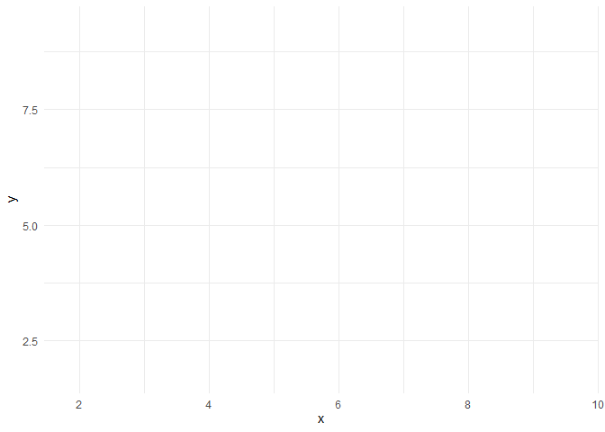

# k-means

## The algorithm

Optimal partition:

-   Choose from all the partitions into K classes the one with the greatest inter inertia.

-   Problem : number of partitions into K classes of the n individuals $\sim \frac{K^n}{K!}.K!$

=\> Complete enumeration impossible.

Locally optimal partition - Heuristic of the type :

-   We start from a feasible solution, i.e. a partition $\mathscr{P}_K^0$

-   At step t + 1, we look for a partition $\mathscr{P}_{K}^{t+1} = g(\mathscr{P}_{K}^{t})$ such that inertia_inter($\mathscr{P}_{K}^{t+1}$) \geq inertia_inter($\mathscr{P}_{K}^{t}$)

-   Stop when no individual changes class between two iterations

=\> Method for partitioning K-means.

### Steps

[Initialization step]{style="color:blue"}:

-   Choosing the number of classes K

-   Random drawing of K class centers (K individuals among n)

[Iteration]{style="color:blue"}(Repeat until convergence):

-   [Assignment step]{style="color:blue"}: each individual is assigned to the class whose center of gravity is the closest.

-   [Representation step]{style="color:blue"}: the centers of gravity of the classes are calculated.

```{r,warning=FALSE,message=FALSE}

library(tidyverse)
library(gganimate)

set.seed(123)
n <- 150

data <- data.frame(
  x = c(rnorm(n, mean = 3, sd = .5), rnorm(n, mean = 8, sd = .5), rnorm(n, mean = 7, sd = .5)),
  y = c(rnorm(n, mean = 5, sd = .5), rnorm(n, mean = 8, sd = .5), rnorm(n, mean = 3, sd = .5))
)

init <- data.frame(
  x = c(3.75,3.2,2.5),
  y = c(5,6,4.5)
)

init$step <- rep(0,nrow(init))

# init1 <- init
# init1$step <- rep(1,nrow(init1))
# init <- rbind(init,init1)

data$step <- rep(0,nrow(data))
data$class <- rep(0,nrow(data))

out <- data.frame()

for (k in 1:3){
  for (i in 1:nrow(data)){
    out[i,k] <- proxy::dist(as.data.frame(data[i,-c(3,4)]),
                           as.data.frame(init[k,-3]),
                           method="euclidean") |> as.numeric()
    }
  }

colnames(out) <- as.character(c(1,2,3))


out <- out %>% mutate(
  class = names(out)[apply(out, MARGIN = 1, FUN = which.min)] 
) 

data2 <- data

data2$class <- out$class
data2$step <- rep(1,nrow(data))

data_plot <- rbind(data,data2)

data_f <- data_plot %>% filter(step == 1)

data_f$step <- rep(2,nrow(data_f))
data_plot <- rbind(data_plot,data_f)

init2 <- data.frame()

for (k in 1:3){
  init2a <- data_plot %>% filter(step ==2) %>% 
    filter(class == k) %>% 
    select(c(x,y)) %>% 
    colMeans()
  init2 <- rbind(init2,init2a)
}

colnames(init2) <- c("x","y")
init2$step <- rep(2,nrow(init2))

init <- rbind(init,init2)

## step 2

out <- data.frame()

for (k in 1:3){
  for (i in 1:nrow(data)){
    out[i,k] <- proxy::dist(as.data.frame(data[i,-c(3,4)]),
                            as.data.frame(init2[k,-3]),
                            method="euclidean") |> as.numeric()
  }
}

colnames(out) <- as.character(c(1,2,3))

out <- out %>% mutate(
  class = names(out)[apply(out, MARGIN = 1, FUN = which.min)] 
) 

data2 <- data

data2$class <- out$class
data2$step <- rep(3,nrow(data))

data_plot <- rbind(data_plot,data2)

data2$step <- rep(4,nrow(data))

data_plot <- rbind(data_plot,data2)

# init2$step <- rep(3,3)
# init <- rbind(init,init2)

init2 <- data.frame()

for (k in 1:3){
  init2a <- data_plot %>% filter(step ==3) %>% 
    filter(class == k) %>% 
    select(c(x,y)) %>% 
    colMeans()
  init2 <- rbind(init2,init2a)
}

colnames(init2) <- c("x","y")
init2$step <- rep(4,nrow(init2))

init <- rbind(init,init2)

```

```{r}
#| fig-format: png

goo <- ggplot() +
  geom_point(data = data_plot %>% mutate(end = step + 1), 
             aes(x, y,
                 color = class), show.legend = FALSE)+
  geom_point(data = init  %>%  mutate(end = step + 1),
             aes(x = x, y = y),
             shape = 4,size = 1,stroke = 2)+
  transition_events(start = step, 
                    end = end,
                    enter_length = 1,
                    exit_length = 1)+
  theme_minimal()

anim_save("goo.gif", goo,renderer = gifski_renderer())


### merg all animation file
dir.create("frames", showWarnings = FALSE)
png_files <- list.files(pattern = "\\.png$", full.names = TRUE)
file.rename(from = png_files,
            to   = file.path("frames", basename(png_files)))
png_files <- list.files(pattern = "^anim_.*\\.png$", full.names = TRUE)
file.rename(from = png_files,
            to   = file.path("frames", basename(png_files)))
```



### Choosing initial centroids

::::: columns
::: {.column width="50%"}
[Random assignment]{style="color:blue"}: K random points in the scatterplot
:::

::: {.column width="50%"}
[k-means++ assignment]{style="color:blue"}: Choose 1 centroid randomly. 2nd centroid at a large distance from the 1st with large prob. : sample a point according to 1 prob, law propor, to the distance to the 1st centroid.
:::
:::::

::::: columns
::: {.column width="50%"}
```{r}
ggplot() +
  geom_point(data = data, 
             aes(x, y), color = "#8785B2FF",show.legend = FALSE)+
  geom_point(data = init %>% filter(step == 0),
             aes(x = x, y = y),
             shape = 4,size = 1,stroke = 2) +
  theme_minimal()

```
:::

::: {.column width="50%"}
```{r}
ggplot() +
  geom_point(data = data, 
             aes(x, y), color = "#8785B2FF",show.legend = FALSE)+
  geom_point(data = init %>% filter(step == 4),
             aes(x = x+0.5, y = y+0.5),
             shape = 4,size = 1,stroke = 2)  +
  theme_minimal()
```
:::
:::::

The final partition depends on the initial partition : if we restart the algorithm with other initial centers, the final partition can be different.

In practice:

-   We run the algorithm N times with different random initializations.

-   We retain among the N final partitions, the one with the largest percentage of explained inertia.

::::: columns
::: {.column width="50%"}
[Advantages]{style="color:blue"}:

-   Relatively efficient (fast).

-   Linear complexity in the number of individuals.

-   Tends to reduce intra-class inertia at each iteration.

-   Tends to increase inter-class inertia at each iteration.

-   Forms compact and well-separated classes.Relatively efficient (fast).
:::

::: {.column width="50%"}
[Disadvantages]{style="color:blue"}:

-   Choice of the number of classes.

-   Influence of the choice of initial centroids.

-   Convergence towards a local minimum of intra-class inertia.

-   Convergence towards a local maximum of the inter-class inertia.

-   Requires the notion of center of gravity.

-   Influence of outliers (due to the mean).
:::
:::::

## Practical

```{r,message=FALSE,echo=TRUE}
#| code-fold: false

library(cluster) 
library(factoextra) 
library(ggplot2)
library(plotly)
library(gridExtra)
```

### Data {.unnumbered}

```{r,message=FALSE,echo=TRUE}
#| code-fold: false

set.seed(123)
n <- 150
data <- data.frame(
x = c(rnorm(n, mean = 2, sd = 0.5), rnorm(n, mean = 6, sd = 0.5), rnorm(n, mean = 10, sd = 0.5)),
y = c(rnorm(n, mean = 10, sd = 0.5), rnorm(n, mean = 6, sd = 0.5), rnorm(n, mean = 2, sd = 0.5))
)
```

```{r}
#| code-fold: false
#| echo: true

ggplot(data, aes(x, y)) +
  geom_point() +
  theme_minimal()
```

### Clustering with 3 clusters {.unnumbered}

```{r}
#| code-fold: false
#| echo: true

set.seed(123)
kmeans_result_1 <- kmeans(data, centers = 3)
data$kmeans_result_1 <- as.factor(kmeans_result_1$cluster)

# Visualization of the results
ggplot(data, aes(x = x, y = y, color = kmeans_result_1)) +
  geom_point(size = 3) + 
  ylim(0,12) +
  labs(title = "Results of k-means with outliers", color = "Cluster") +
  theme_minimal()
```

### Renormalization

::: callout-note
The k-means method relies on distance calculations (usually the Euclidean distance) to group points into clusters. If the variables have different scales, those with larger amplitudes will have a disproportionate influence on the calculation of distances, which can distort the clustering results.

Example:

-   If one variable is measured in kilometers and another in meters, the first will dominate the calculations.

-   Renormalizing (often using standardization or normalization) allows to put all variables on the same scale, preventing some variables from biasing the distances.
:::

Add the 3rd variables with a different scale

```{r}
#| code-fold: false
#| echo: true

data$z <- c(rnorm(2 * n, mean = 50, sd = 5), rnorm(n, mean = 100, sd = 5))
head(data)

data_scaled <- scale(data[,c(1,2,4)])
```

::::: columns
::: {.column width="50%"}
Data without renormalization

```{r}
#| message: false
plot_ly(data, x = ~x, y = ~y, z = ~z)
```
:::

::: {.column width="50%"}
Data with renormalization

```{r}
#| message: false
plot_ly(data.frame(data_scaled), x = ~x, y = ~y, z = ~z)
```
:::
:::::

```{r}
#| code-fold: false
#| echo: true

# Comparison with and without renormalisation
# k-means without renormalization
kmeans_no_scaling <- kmeans(data, centers = 3, nstart = 25)
data$cluster_no_scaling <- as.factor(kmeans_no_scaling$cluster)

# k-means with renormalization
data_scaled <- scale(data[,c(1,2,4)])
kmeans_scaling <- kmeans(data_scaled, centers = 3, nstart = 25)
data$cluster_scaling <- as.factor(kmeans_scaling$cluster)

# Data visualization
p1 <- ggplot(data, aes(x, y, color = cluster_no_scaling)) +
geom_point() + 
  ggtitle("Clustering without renormalization") +
  theme_minimal()+
  theme(legend.position = "none")

p2 <- ggplot(data, aes(x, y, color = cluster_scaling)) +
  geom_point() +
  ggtitle("Clustering with renormalisation") +
  theme_minimal()+
  theme(legend.position = "none")

grid.arrange(p1, p2, ncol = 2)
```

### Choosing $k$: elbow method

The elbow method aims to determine the optimal number of clusters ($k$) by visualizing the relationship between the number of clusters and the total intra-cluster inertia (tot.withinss).

-   Observation: We generally observe a rapid decrease in inertia when k increases, followed by a slowdown.

-   Elbow Point: The “elbow” of the graph corresponds to the point where adding an additional cluster no longer significantly improves the reduction of inertia. This point indicates the optimal number of clusters. In the given example, the elbow is observed at k=3, which suggests that 3 clusters are appropriate for the data... this is a bit of the expected result...

```{r}
#| code-fold: false
#| echo: true

# Calculating intra-cluster inertia for different numbers of clusters
set.seed(123)
inertias <- sapply(1:10, function(k) {
  kmeans(scale(data[,c(1,2)]), centers = k, nstart = 25)$tot.withinss
})

# Visualization of the elbow criterion
plot(1:10, inertias, type = "b", pch = 19, frame = FALSE,
     xlab = "Number k of clusters", ylab = "Intra-cluster inertia",
     main = "The elbow method to choose the number k of clusters")
abline(v = 3, lty = 2, col = "red")
```

### Silouhette computation

```{r}
#| code-fold: false
#| echo: true

# Silhouette computation
set.seed(123)
final_kmeans <- kmeans(scale(data[,c(1,2)]), centers = 3, nstart = 25)
silhouette_scores <- silhouette(final_kmeans$cluster, dist(scale(data[,c(1,2)])))

# Silouhette visualization
fviz_silhouette(silhouette_scores) +
  ggtitle("Silouhette analyse")

```
